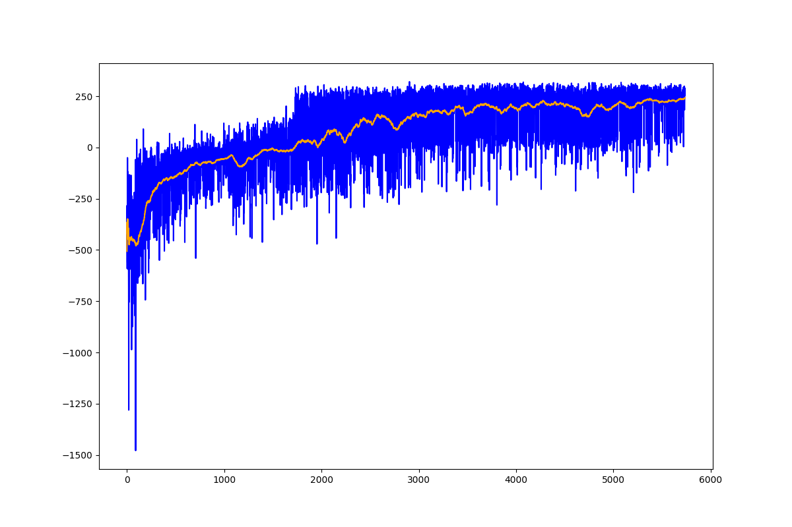

# LunarLander

Testing the differences between each type of machine learning algorithm to their strengths and weaknesses.

## Deep Q-Network (DQN)

    python3 dqn.py

The deep q-network actually surprised me quite a bit.

## Double Deep Q-Network (DDQN)

    python3 ddqn.py

The deep q-network performed as expected, but wasn't quitee as stable as what I was predicting.

## REINFORCE

    python3 reinforce.py

The reinforce algorithm was stable and had trouble reaching its max performance.  It also surprised me at how noisy this algorithm was.

## Advantage Actor-Critic (A2C)

    python3 a2c.py

The advantage actor-critic model worked quite well.

## Overall

some comments here

