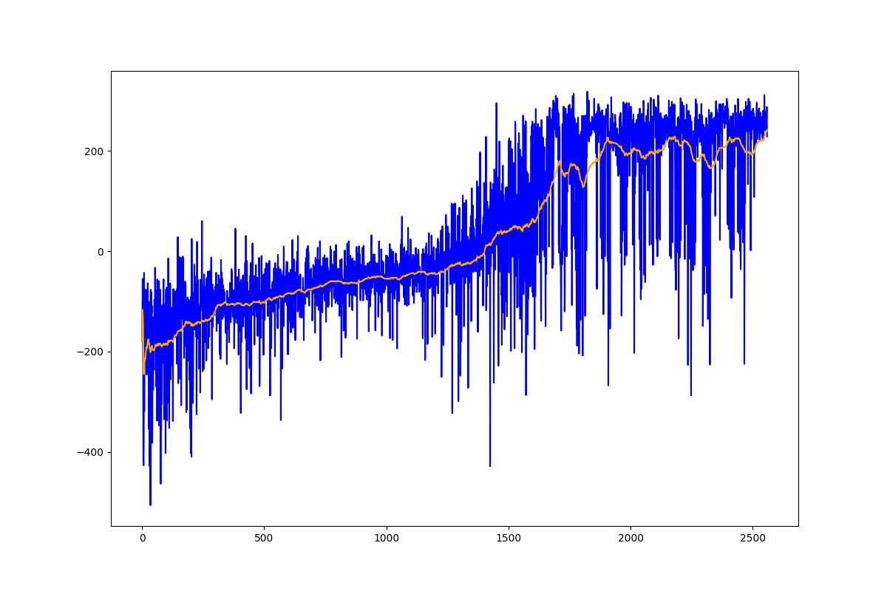
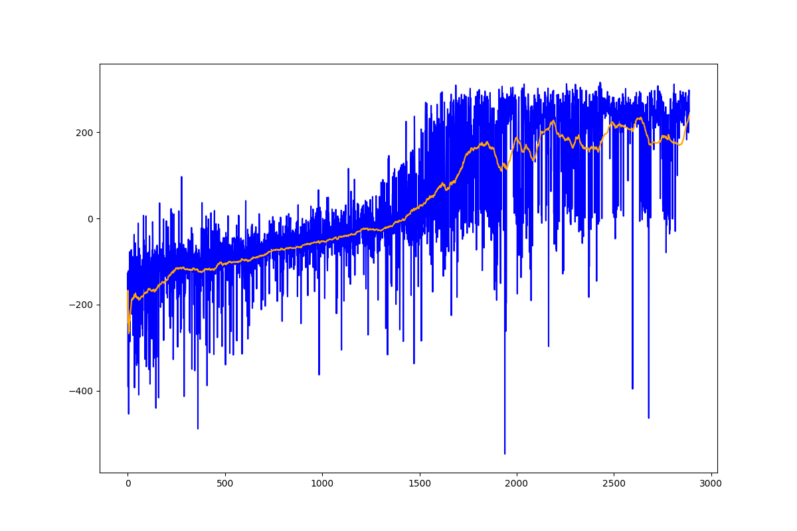

# LunarLander

Testing the differences between each type of machine learning algorithm to their strengths and weaknesses.

## Deep Q-Network (DQN)

    python3 dqn.py

The deep q-network actually surprised me quite a bit.  I thought that it would take longer and more episodes due to not having the noise 'rejection' that a double deep q- network has.

## Double Deep Q-Network (DDQN)

    python3 ddqn.py

The deep q-network performed as expected, but took more episodes than I was expecting.

## Off Policy Comparison

Surprisingly the Deep Q-Network was more stable and trained faster than the 'new and improved' Double Deep Q-Network developed by [DeepMind](https://arxiv.org/pdf/1509.06461.pdf).  It is possible that specifically in LunarLander-v2 the DQN doesn't suffer from overestimations that the DDQN was developed to solve.

## REINFORCE

    python3 reinforce.py

The reinforce algorithm was stable, but looked to have be very slow at achieving any greater performance than it did.  REINFORCE also surprised me at how noisy it was during training.  If there wasn't an averaging curve I wouldn't have been able to tell it was getting improving.

## Advantage Actor-Critic (A2C)

    python3 a2c.py

The advantage actor-critic model worked quite well.  It appeared to have some difficulties in the middle of training but it eventually recovered.  Had I let it train longer I expect it could have reached a significantly higher score.

## On Policy Training

When comparing the two I expect that the A2C model had a higher ceiling than the REINFORCE model.  It makes sense that the A2C took longer to train because it had to train both an actor and a critic while the REINFORCE model only had to train a single model.  It also had a larger network to train than the REINFORCE model.

